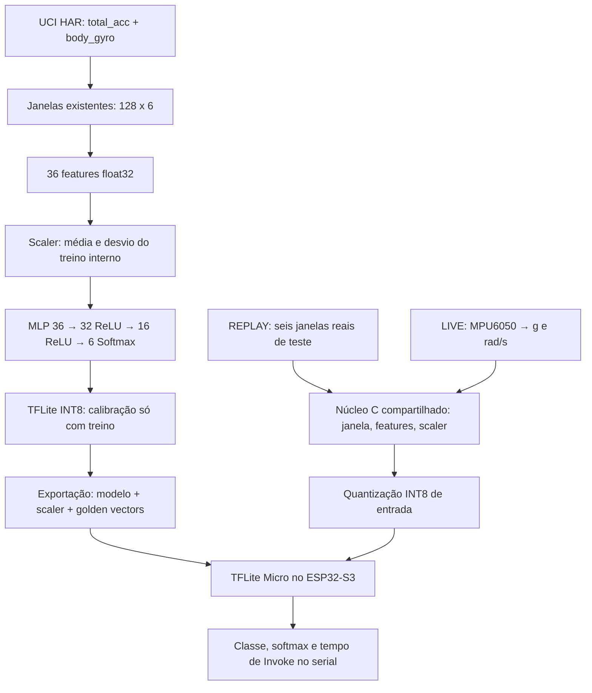

# Arquitetura

## Contrato dos sinais

Ordem por amostra: `total_acc_x, total_acc_y, total_acc_z, body_gyro_x, body_gyro_y, body_gyro_z`. Aceleração em **g**, giroscópio em **rad/s**. A matriz é row-major `[128][6]`. Frequência nominal 50 Hz, duração da janela 2,56 s, passo de 64 amostras (1,28 s). As janelas do UCI já existem; não se concatenam janelas de atividades/pessoas diferentes nem se aplica um segundo recorte.

O MPU6050 entrega aceleração total; usar `body_acc` do UCI exigiria reproduzir a separação da gravidade, ausente no sensor. Por isso preservamos `total_acc` e não usamos `body_acc` nem as 561 features prontas. `body_gyro` é a velocidade angular disponibilizada pelo dataset, não um giroscópio que exija subtrair gravidade.

O sensor é configurado em ±2 g (16.384 LSB/g), ±250 °/s (131 LSB/(°/s)), leitura big-endian com sinal. Converte-se °/s para rad/s multiplicando por π/180. Temperatura é ignorada. O DLPF é configurado em aproximadamente 20 Hz e o divisor em 19, para 1.000/(19+1)=50 Hz. Referência: [mapa de registradores do fabricante](https://invensense.tdk.com/wp-content/uploads/2015/02/MPU-6000-Register-Map1.pdf).

## Limite estrutural do LIVE

O UCI fornece sinais já filtrados e segmentados. Não fornece, nessa versão, o fluxo bruto contínuo e todos os estados de filtro necessários para repetir exatamente a cadeia original em um MPU6050. O DLPF do MPU6050 não equivale aos filtros offline do smartphone. Unidades iguais e código de features igual não removem essa diferença.

O dispositivo original foi fixado na cintura. A montagem e os sinais dos eixos do MPU devem corresponder ao referencial usado no treinamento. O firmware mantém identidade dos eixos, sem inventar uma rotação que não foi medida. Não se afirma que colocar o módulo em qualquer orientação funcione.

Solução correta: coletar sessões rotuladas com o próprio MPU6050, mesma fixação, taxa, escalas e filtro; calibrar offset/ganho e orientação; separar pessoas/sessões antes das janelas; treinar/fazer fine-tuning e avaliar pessoas independentes. Outra alternativa é usar dados realmente brutos, como a versão de transições posturais apontada pela UCI, aplicando uma cadeia causal idêntica em Python e firmware. Não basta inserir um filtro arbitrário só no LIVE.

## Firmware

`har_core` não depende do ESP-IDF. O teste host compila o **mesmo arquivo C**, incluindo buffer, conversão de registradores, features, normalização e quantização. Compilação sem fast-math e sem contração FMA reduz divergências.

REPLAY reinsere cada janela no buffer zerado, calcula todas as etapas e invoca o modelo. Não alimenta apenas features prontas. Compara 36 features (`atol=1e-5, rtol=1e-5`), os 36 bytes de entrada (exatos), as seis saídas (erro ≤2/256) e a classe com o desktop. As seis janelas são a primeira ocorrência de cada classe no teste, antes de conhecer as previsões. Essa pequena amostra não substitui a avaliação completa.

LIVE: tarefa de aquisição prioritária chama I2C a cada 20 ms, envia snapshots prontos à fila; a tarefa principal faz inferência. Uma falha I2C ou intervalo fora de 10–30 ms reinicia a janela. Fila cheia descarta uma janela com aviso, preservando a aquisição. O polling nominal não garante sincronismo exato com cada conversão interna: para coleta científica futura, usar data-ready/FIFO e timestamps, além de medir jitter e perdas. Os logs não afirmam validação temporal já realizada em hardware.

O modelo usa somente `FULLY_CONNECTED` e `SOFTMAX`, com ReLU fundida. Entrada e saída INT8, pesos INT8 e acumuladores/bias INT32; features continuam float32. Quantização de entrada: `clip(round_away(z/scale)+zero_point, -128,127)`. Saída: `(q-zero_point)*scale`.

## Memória e temporização

MLP: 1.814 parâmetros. Modelo INT8: 4.240 bytes em flash. Arena reservada: 32 KiB estáticos; uso real é impresso pelo TFLM. Cada janela ocupa 3.072 bytes; LIVE inclui buffer, snapshot, saída e fila de duas janelas, além das stacks. O replay usa aproximadamente 18 KiB de sinais constantes em flash. Não confundir tamanho de modelo com RAM total.

`invoke_us` mede apenas `Invoke()`, não janela, aquisição, features ou serial. Latência inicial inclui 2,56 s de coleta; novas janelas aparecem a cada 1,28 s. Tempo do simulador não é benchmark confiável do dispositivo físico.
