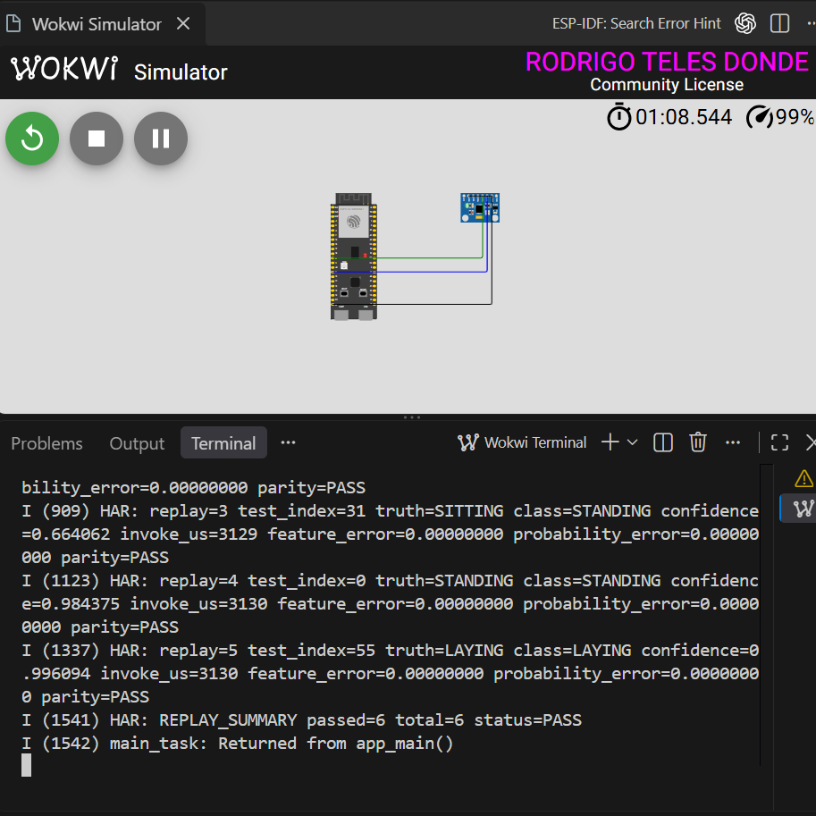

# Conferência de requisitos para a entrega

Auditoria em 05/10/2026. Conclusão: há um protótipo de IA embarcada executado
no ESP32-S3 simulado, com treinamento, quantização, métricas e evidência de
equivalência. As demonstrações REPLAY e LIVE estão comprovadas no Wokwi. A
apresentação e a publicação ainda devem ser tratados separadamente.

## Quais requisitos foram conferidos

Foram usadas duas fontes distintas:

- **PDF fornecido, 16 páginas:** página 7 pede desenvolvimento e apresentação
  de um protótipo funcional de IA embarcada; página 14 permite substituir o
  kit pelo Wokwi. Páginas 6 e 8 indicam apresentações em 06/10 e 08/10.
  A apresentação ainda precisa ser realizada pelo aluno.
- **Texto inicial anexado pelo usuário:** contém a lista detalhada atribuída
  ao professor e as escolhas deste projeto, incluindo os modos LIVE/REPLAY,
  métricas, Git Flow e documentação. Essa lista foi conferida item a item.

O PDF não contém uma rubrica detalhada de pontuação, nota mínima de accuracy,
formato dos slides, link de submissão ou exigência inequívoca de relatório
PDF/vídeo. Não inventamos esses critérios nem garantimos aprovação acadêmica.
Se houver outro enunciado no ambiente da disciplina, ele deve ser comparado
com este checklist antes da submissão.

## Lista de requisitos obrigatórios informada no texto

| Requisito | Situação | Evidência e limite |
|---|---|---|
| Coletar **ou utilizar** dados coerentes com sensores | Atendido | UCI HAR oficial: aceleração total em g e giroscópio em rad/s; `data/provenance.json`, `ml/src/prepare.py`. Não foi feita coleta MPU6050 própria. |
| Treinar ou fazer fine-tuning | Atendido por treinamento | `har_fp32.keras`, `ml/src/train.py`, `training.json`: 33 épocas, melhor época 13, 1.814 parâmetros. Fine-tuning não é necessário para cumprir a alternativa. |
| Converter e comprimir | Atendido | TFLite FP32 de 9.072 bytes e INT8 de 4.240 bytes, redução de 53,26%; `conversion.json`. |
| Deploy real **ou simulado** | Atendido em simulação | Wokwi executou o firmware ESP-IDF no ESP32-S3; serial real com 6/6 PASS e screenshot. Não há deploy físico comprovado. |
| Pipeline completa de entrada até inferência | Atendido em REPLAY e LIVE no Wokwi | REPLAY: amostras reais → buffer → features → scaler → INT8 → TFLM. LIVE: MPU6050 simulado → I2C → janela → features → INT8 → classe/confiança. |
| Problema real e justificativa para IA | Justificativa documentada | Reconhecimento de atividades a partir de padrões multicanais; README/metodologia. Há generalização medida em pessoas não vistas. Não foi demonstrada superioridade sobre todas as soluções de regras nem há estudo de impacto em uso real. |
| Código organizado e legível | Estrutura atendida, revisão qualitativa | Módulos ML separados; núcleo C compartilhado; driver, inferência e aplicação separados; scripts e testes. A avaliação de legibilidade pelo professor é subjetiva. |
| Preparar repositório público com Git Flow | Preparação atendida; publicação/histórico pendentes | `.gitignore`, README, workflow CI e `docs/git_flow.md`; repositório local sem commits, remoto ou branches com histórico. Não alegar que Git Flow já foi executado. |
| Não fazer commits/push automaticamente | Respeitado | Sem commits, staging, remoto ou push nesta implementação. |

## Conferência técnica do projeto escolhido

| Item | Situação / localização |
|---|---|
| ESP32-S3, ESP-IDF, MPU6050, Wokwi | Presentes em `firmware/`, `diagram.json`, `wokwi.toml`; ESP-IDF 5.4.2 mantido. |
| Seis classes solicitadas | Mapeamento 0–5 em `ml/src/common.py`, parâmetros exportados e métricas. |
| Compatibilidade sensor/dataset | Analisada em `docs/arquitetura.md`: total_acc, gravidade preservada, unidades, eixos e diferenças de filtros. LIVE não é presumido equivalente ao smartphone. |
| Frequência/janelas | 50 Hz, 128 amostras, passo 64. Buffer C verifica overlap e ordem. Dataset já janelado não recebe segundo recorte. |
| Features | 36: média, desvio populacional, RMS, mínimo, máximo, energia média por canal; redundância RMS/energia justificada como baseline. |
| Normalização | Média/desvio ajustados apenas no treino interno, exportados em float32. |
| Sem data leakage | Split oficial de teste preservado; ajuste/validação por voluntário; scaler e calibração INT8 apenas no ajuste. |
| MLP inicial | 36→32 ReLU→16 ReLU→6 Softmax implementada, 1.814 parâmetros. |
| Accuracy, macro F1 e matriz de confusão | Calculados para Keras FP32, TFLite FP32 e INT8; `ml/reports/metrics.json` e `results.md`. |
| Comparação de tamanho/perda | INT8 81,13% accuracy / 0,8070 macro F1; queda de 0,135731 ponto percentual frente ao TFLite FP32. |
| Driver I2C e seis eixos | Implementados em `mpu6050.c`; WHO_AM_I, configuração, leitura 14 bytes e conversão g/rad/s. Compilar não comprova leitura em execução. |
| Normalização/quantização/Invoke/dequantização | Presentes em `har_core` e `inference.cpp`, executados no REPLAY. |
| Saída serial | Classe, confiança e tempo de Invoke via ESP_LOGI, visíveis no log/screenshot. |
| REPLAY | Seis janelas reais de teste escolhidas antes de prever; 6/6 comparações numéricas PASS no Wokwi com ANSI C. |
| LIVE | Executado no Wokwi com ANSI C: inferências contínuas a cada 1,28 s; `evidencias/live-wokwi.txt`. Não há avaliação de accuracy MPU6050. |
| SDA 8 / SCL 9 | Configurados. Auditoria corrigiu alimentação no diagrama de `esp:3V3` para `esp:3V3.1`. |
| Kernels | ANSI C aprovado no REPLAY. O caminho otimizado apresentou divergência no Wokwi; causa específica não isolada em instrução/kernel e não testada em placa física. |

O nome correto de alimentação foi conferido na
[definição oficial da placa no Wokwi](https://github.com/wokwi/wokwi-boards/blob/main/boards/esp32-s3-devkitc-1/board.json).
A screenshot recebida é anterior à correção da ligação; preservamos o arquivo
original, que continua sendo evidência válida da inferência REPLAY.

## Organização, documentação e reprodutibilidade

| Item solicitado | Evidência |
|---|---|
| Estrutura docs/data/ml/firmware/tests/evidencias/scripts | Criada; inventário em `docs/arquivos_criados.md`. |
| README e requirements | README, requirements.txt, requirements-dev.txt e lock do ambiente Windows. |
| Ambiente virtual local | `.venv/`; instalações ML sem alteração de pacotes globais. |
| Seeds fixas | 42 para divisão, treino e calibração. |
| Download/preparação/treino/avaliação/exportação | `scripts/download_dataset.py`, módulos `ml/src/`, `scripts/run_pipeline.ps1`. |
| Fonte oficial | UCI, URL e hash registrados. Dataset bruto não incluído no Git. |
| Equivalência Python/firmware | Mesmo núcleo C compilado no host; 10 golden vectors; teste embarcado de seis janelas. |
| Testes executados | Auditoria repetiu a suíte: **21 passed em 3,60 s**. |
| Arquitetura e metodologia | `docs/arquitetura.md`, `docs/metodologia.md`. |
| Apresentação até 10 minutos / perguntas e respostas | `docs/guia_apresentacao.md`; roteiro pronto, slides finais e ensaio ainda não realizados. |
| Problema, IA, dataset, features, treino, quantização, LIVE/REPLAY, limites e execução | Cobertos pelo README e documentos acima. |
| Resultados | Métricas completas, matrizes, treino, conversão e referências de REPLAY em `ml/reports/`. |
| Evidências | Seriais REPLAY e LIVE, screenshot original, testes e hashes dos builds em `evidencias/`. |
| Sem alteração indevida de SDK/managed_components/Git global | SDK existente reutilizado, componentes instalados pelo gerenciador, sem edição manual das dependências. |

## Próximos passos, por ordem

1. **Apresentação:** transformar o roteiro em slides e ensaiar até 10 minutos.
   Mostrar problema, dataset/split, 36 features, MLP, tabela FP32/INT8, matriz
   de confusão, execução e limitações. Usar a captura/serial como backup.
2. **Entrega GitHub:** revisar arquivos/licença e executar publicação e Git
   Flow manualmente, respeitando a proibição atual de commits/push automáticos.
3. **Conferir o local de entrega:** confirmar no ambiente da disciplina se
   pedem link, slides, relatório ou vídeo além da apresentação. Esses detalhes
   não constam das fontes recebidas.

Não é necessário afirmar que o protótipo foi validado em hardware físico
para demonstrar a alternativa simulada prevista no PDF. Coleta própria e
avaliação LIVE são necessárias se for alegada precisão com o MPU6050 real.

## Evidência LIVE

O LIVE foi executado no Wokwi com `kernels=ESP_NN_ANSI_C`, formou a primeira
janela em 2,56 s e gerou inferências sucessivas a cada 1,28 s. A arena usada
foi 860 bytes dentro dos 32 KiB reservados. `Invoke()` variou de 3.125 a
3.126 us no simulador. O serial está em `evidencias/live-wokwi.txt`.

A classe foi `LAYING` com confiança 0,996094 para um sensor parado. Isso é
coerente com a postura estática simulada, mas não é um rótulo controlado nem
serve para medir accuracy. O Wokwi não reproduz uma pessoa caminhando ou
subindo escadas. Para voltar à demonstração REPLAY validada:

```powershell
powershell -NoProfile -ExecutionPolicy Bypass -File scripts/select_wokwi_mode.ps1 -Mode REPLAY
```

Pare e reinicie Wokwi após cada troca. O arquivo padrão foi devolvido a REPLAY
ao final desta auditoria.

## Como interpretar a evidência

**6/6 PASS = equivalência de implementação nas seis janelas**, não 100% de
accuracy. Nessas janelas o classificador acerta três classes verdadeiras;
nos 2.947 exemplos de teste a accuracy INT8 é 81,13%. O firmware reproduz
inclusive os erros do modelo desktop. Esse resultado deve ser mostrado
com transparência na apresentação.


