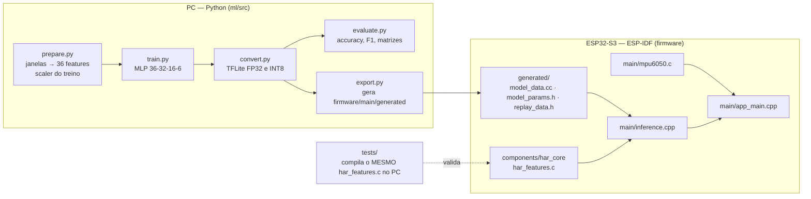
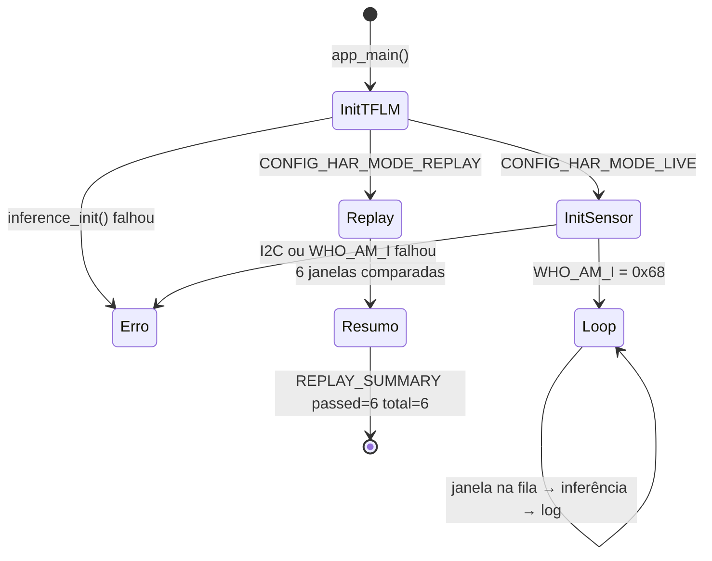
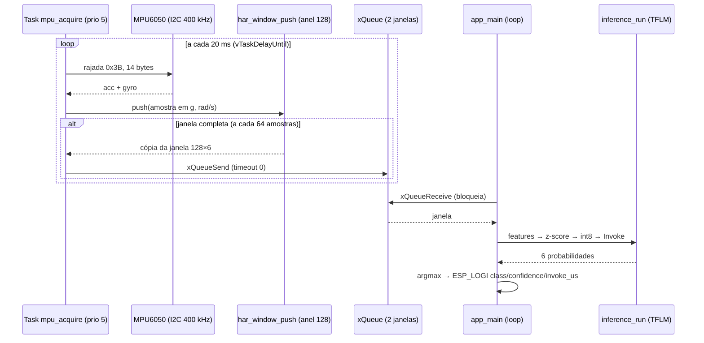

# Guia de leitura do código

> **Rascunho para revisão** — branch `feature/demonstracao-renan`.
> Este guia explica o que o código faz e **por que** cada decisão foi tomada, arquivo por arquivo.
> Ele não altera nenhum arquivo de firmware ou de modelo, que estão congelados desde a validação e a gravação do vídeo.
> Os números citados vêm de `ml/reports/` e `firmware/main/generated/`.
>
> **Fundamentação:** cada seção indica o slide da UC que embasa a decisão, no formato **[A3, p. 29]** (Aula 3, página 29 do PDF).
> A lista completa, com os nomes dos arquivos, está na [seção 9](#9-referências-ao-material-de-aula).

## Mapa do repositório em uma figura

O ponto central: **`har_features.c` é um único arquivo C usado em dois lugares**. Ele compila no ESP32-S3 e também no PC, onde os testes o carregam via `ctypes` e comparam com o Python. É isso que garante que o firmware calcula exatamente o que o modelo viu no treino.

---

## 1. Lado Python — `ml/src/`

**Fundamentos:**
- O pipeline “dado → pré-processamento → treino → avaliação → compressão → conversão → deploy” é o ciclo de vida do modelo da UC **[A3, p. 9–11]**.
- A contagem de parâmetros das camadas Dense é feita com `entradas × neurônios + bias` **[A3, p. 7]** e conferida pelo Keras **[A3, p. 18]**.
- A janela fixa com sobreposição segue o janelamento da Aula 6 **[A6, p. 24]**.
- A normalização usa Z-score **[A6, p. 22]**.

| Arquivo | Responsabilidade | Detalhe que vale explicar |
|---|---|---|
| [`common.py`](../ml/src/common.py) | Contrato compartilhado: caminhos, `SEED=42`, `WINDOW=128`, `STRIDE=64`, ordem dos 6 canais, 6 estatísticas, 6 classes | Mudar a ordem de `CHANNELS` ou `STATS` aqui sem reexportar quebra a correspondência com o C |
| [`prepare.py`](../ml/src/prepare.py) | Lê `Inertial Signals`, extrai features, separa treino e validação **por voluntário** (`GroupShuffleSplit`), ajusta o scaler, escolhe as 6 janelas de REPLAY | `assert set(subjects).isdisjoint(test_subjects)`: nenhum voluntário de teste aparece no treino. O REPLAY usa a **primeira** janela de cada classe, escolhida antes de qualquer inferência (sem *cherry-picking*) |
| [`features.py`](../ml/src/features.py) | Média, desvio, RMS, mín., máx. e energia por canal → 36 valores. Também `normalize` e `quantize` | Os laços são **sequenciais em float32**, para reproduzir a ordem de soma do C. O `quantize` usa *round half away from zero*, igual ao `roundf` do C99 |
| [`train.py`](../ml/src/train.py) | MLP `36 → 32 ReLU → 16 ReLU → 6 Softmax`, Adam (lr 0,001), batch 64, `EarlyStopping(patience=20)` na validação | 1.814 parâmetros. Rodou 33 épocas e restaurou a melhor, a 13. Threads e semente fixas para ser determinístico |
| [`convert.py`](../ml/src/convert.py) | Gera `har_fp32.tflite` e `har_int8.tflite` | O INT8 é **full-integer**: entrada e saída `int8`, calibrado com 512 janelas **só do treino**. O script falha se sobrar algum tensor float32 ou op diferente de `FULLY_CONNECTED`/`SOFTMAX` |
| [`evaluate.py`](../ml/src/evaluate.py) | Avalia os 3 modelos nas 2.947 janelas de teste | Gera `metrics.json` e `results.md` |
| [`export.py`](../ml/src/export.py) | Escreve `model_data.cc`, `model_params.h` (scaler + quantização + classes) e `replay_data.h` | É **a única fonte** dos arquivos em `generated/`. Nunca editar esses arquivos à mão |

### Como os dados foram divididos

| Conjunto | Janelas | Voluntários | Uso |
|---|---:|---|---|
| Treino (fit) | 5.551 | 16 | Ajuste dos pesos, do scaler e da calibração INT8 |
| Validação | 1.801 | 5 (1, 3, 15, 25, 27) | Early stopping, sem tocar no teste |
| Teste oficial UCI | 2.947 | 9 | Métricas publicadas; usado uma única vez |

---

## 2. Artefatos gerados — `firmware/main/generated/`

| Arquivo | Conteúdo | Por que existe |
|---|---|---|
| `model_data.cc` / `.h` | `g_har_model[]`: o `.tflite` INT8 como array de bytes (4.240 B) | O MCU não tem sistema de arquivos para ler o `.tflite`, então o modelo entra no binário e fica na flash |
| `model_params.h` | `HAR_MEAN[36]`, `HAR_SCALE[36]`, `HAR_INPUT_SCALE=0.0585160591`, `HAR_INPUT_ZERO=-19`, `HAR_OUTPUT_SCALE=0.00390625` (=1/256), `HAR_OUTPUT_ZERO=-128`, `HAR_CLASSES[6]` | O pré-processamento do C precisa usar **as mesmas constantes do treino**. Recalcular média e desvio no device mudaria a distribuição da entrada |
| `replay_data.h` | 6 janelas reais de teste (`128×6` floats cada) + features, entradas INT8 e probabilidades esperadas do desktop | É o gabarito do modo REPLAY |

**Fundamentos:**
- O `.tflite` é um FlatBuffer **[A4, p. 7]** e vira array C (`xxd -i`) para ser embutido no firmware **[A4, p. 36–37]**.
- Os pesos ficam na **Flash**, e as ativações e a arena ficam na **SRAM** **[A3, p. 19–20]**.

> **Por que a confiança máxima é 0,996094?** A saída INT8 tem `scale = 1/256` e `zero_point = −128`.
> O maior valor possível é `(127 − (−128)) × 1/256 = 255/256 = 0,996094`. Não é “quase 100% de certeza”: é o teto da representação.

---

## 3. Núcleo C portátil — `firmware/components/har_core/`

[`har_features.h`](../firmware/components/har_core/include/har_features.h) define o contrato:

| Macro | Valor | Significado |
|---|---:|---|
| `HAR_WINDOW` | 128 | Amostras por janela (2,56 s a 50 Hz) |
| `HAR_CHANNELS` | 6 | `acc_x, acc_y, acc_z` (g) e `gyro_x, gyro_y, gyro_z` (rad/s) |
| `HAR_FEATURES` | 36 | 6 canais × 6 estatísticas |
| `HAR_STRIDE` | 64 | Nova inferência a cada 64 amostras (1,28 s; overlap de 50%) |

Funções de [`har_features.c`](../firmware/components/har_core/har_features.c):

| Função | O que faz | Ponto não óbvio |
|---|---|---|
| `har_extract` | 36 features da janela row-major `[128][6]` | A variância é calculada em **duas passadas** (média, depois desvios), como no Python. Rejeita `NaN`/`Inf` |
| `har_normalize` | `z = (x − média) / desvio` com as constantes do `model_params.h` | Recusa `scale ≤ 0` em vez de dividir por zero |
| `har_quantize` | `q = round(z / scale) + zero_point`, saturado em `[−128, 127]` | É a fórmula de quantização afim da Aula 3. O saturamento evita *overflow* do `int8_t` |
| `har_window_reset` / `har_window_push` | Buffer circular de 128 amostras; devolve `true` quando há janela nova | A primeira janela sai na 128ª amostra e as seguintes a cada 64 (`since_emit`). A cópia desenrola o anel em ordem cronológica |
| `har_mpu_decode` | 14 bytes do MPU6050 → 6 floats em g e rad/s | Bytes 0–5 = acelerômetro, 6–7 = temperatura (ignorada), 8–13 = giroscópio; big-endian com sinal |

**Fundamentos:**
- A quantização mapeia o intervalo float para int8 com escala e ponto zero **[A3, p. 24–27]**; aqui o esquema é afim, porque `zero_point ≠ 0`.
- Feita depois do treino, ela é a **PTQ** **[A3, p. 29]**, com o conversor do TFLite **[A3, p. 30]**.
- O pré-processamento precisa ser idêntico no treino e no device: é o bloco *Preprocessing* do lado embarcado **[A3, p. 10–11]**.
- Arrays em C não checam limites **[A2, p. 55]**: por isso o tamanho de todos os buffers vem das macros `HAR_*`.

As **flags `-ffp-contract=off -fno-fast-math`** no `CMakeLists.txt` impedem o compilador de fundir `a*b+c` numa instrução FMA ou de reordenar somas.
Qualquer uma dessas otimizações muda o último bit do float e quebra a igualdade exata com o Python.

---

## 4. Sensor — `firmware/main/mpu6050.c`

Usa o **driver I2C novo** do ESP-IDF 5.x (`driver/i2c_master.h`: `i2c_new_master_bus` → `i2c_master_bus_add_device`), e não a lib legada `espressif/mpu6050`.
Isso evita a dependência do driver I2C legado, que está em fim de vida.

**Fundamentos:**
- O I2C usa barramento de 2 fios com endereço e pull-ups **[A1, p. 40]**.
- O MPU6050 é uma IMU (acelerômetro + giroscópio MEMS, I2C, ADC de 16 bits) **[A6, p. 14–15]**.
- O exemplo da UC configura o I2C, chama o `WHO_AM_I` e lê acc/gyro **[A2, p. 79–81; A6, p. 16–17]**. Este projeto faz as mesmas etapas pela API nova.
- A taxa de 50 Hz respeita Nyquist (amostrar a pelo menos 2× a maior frequência de interesse) **[A6, p. 6]**.
- O DLPF é o filtro passa-baixa antes da amostragem **[A6, p. 23]**.
- A resolução do ADC em bits define os LSB/g **[A1, p. 32]**.

### Tabela de registradores usada no código

| Valor no código | Registrador (datasheet) | Valor escrito | Efeito |
|---|---|---|---|
| `0x68` | Endereço I2C | — | AD0 ligado ao GND no `diagram.json` → endereço `0x68` |
| `0x75` | `WHO_AM_I` | (leitura) | Deve responder `0x68`; senão `ESP_ERR_NOT_FOUND` — primeiro teste de fiação |
| `0x6B` | `PWR_MGMT_1` | `0x80` | *Device reset*; espera 100 ms |
| `0x6B` | `PWR_MGMT_1` | `0x01` | Acorda o chip e usa o PLL do giroscópio X como clock (mais estável que o oscilador interno) |
| `0x1A` | `CONFIG` | `0x04` | DLPF ≈ 20 Hz. Filtro anti-aliasing antes da decimação para 50 Hz (Nyquist = 25 Hz) |
| `0x19` | `SMPLRT_DIV` | `19` | Taxa = 1 kHz / (1 + 19) = **50 Hz**, a mesma do UCI HAR |
| `0x1B` | `GYRO_CONFIG` | `0` | ±250 °/s → 131 LSB/(°/s) |
| `0x1C` | `ACCEL_CONFIG` | `0` | ±2 g → 16.384 LSB/g |
| `0x3B` | `ACCEL_XOUT_H` | (leitura em rajada de 14 bytes) | Lê acelerômetro, temperatura e giroscópio numa só transação, sem desalinhamento temporal entre os eixos |

Clock I2C de **400 kHz** (*fast mode*). Uma rajada de 14 bytes leva cerca de 0,4 ms, folga grande frente ao período de 20 ms.

**Conversão para as unidades do UCI:** `acc[g] = raw / 16384` e `gyro[rad/s] = raw / 131 × π/180`.
O UCI publica `total_acc` em g e `body_gyro` em rad/s. Sem essa conversão, o modelo veria números até 57× maiores no giroscópio.

---

## 5. Inferência — `firmware/main/inference.cpp`

Arquivo em **C++** porque o TensorFlow Lite Micro é uma biblioteca C++. As funções expostas (`inference_init`, `inference_run`) são chamadas pelo `app_main.cpp`.

**Fundamentos:**
- O TFLite Micro é escrito em C++, roda sem sistema operacional e **sem alocação dinâmica** de memória, por isso usa a tensor arena estática **[A4, p. 25–27]**.
- A estrutura “carregar modelo → resolver de ops → interpretador → `AllocateTensors` → `Invoke`” segue o Hello World da UC **[A4, p. 28–33]**.
- Desligar o ESP-NN para rodar no Wokwi é a modificação ensinada na aula **[A4, p. 41]**.
- `esp_timer`/`esp_err_t` seguem o tratamento de erros do ESP-IDF **[A2, p. 58]**.

| Trecho | O que faz | Por que |
|---|---|---|
| `alignas(16) static uint8_t arena[CONFIG_HAR_TENSOR_ARENA_BYTES]` | Tensor arena de 32 KB (Kconfig) | O TFLM não usa `malloc`: todos os tensores intermediários vivem nesse bloco estático. O log mostra **860 B usados**, porque o modelo é pequeno |
| `MicroMutableOpResolver<2>` com `AddFullyConnected` + `AddSoftmax` | Registra só os 2 operadores do modelo | Registrar só o necessário economiza flash. A lista bate com o `conversion.json` |
| Checagens após `AllocateTensors()` | Confere o tipo `int8`, os shapes `[1,36]`/`[1,6]` e se `scale`/`zero_point` do modelo são iguais aos do `model_params.h` | Se alguém trocar o modelo sem reexportar os parâmetros, o init **falha** em vez de inferir errado em silêncio |
| `inference_run` | extract → normalize → quantize → `Invoke()` → dequantize | É o pipeline de pré-processamento → interpretador → pós-processamento da Aula 3 |
| `esp_timer_get_time()` em volta do `Invoke()` | Mede `invoke_us` (≈3.100 µs no Wokwi) | É latência **simulada**; não vale como benchmark de placa |
| `CONFIG_NN_ANSI_C=y` (`sdkconfig.defaults`) | Kernels de referência em C puro em vez do ESP-NN otimizado | No Wokwi, o ESP-NN produziu saídas divergentes; o ANSI C reproduziu o desktop (ver `docs/validacao.md`) |

---

## 6. Aplicação — `firmware/main/app_main.cpp`

Dois modos, escolhidos em tempo de compilação pelo Kconfig (`idf.py menuconfig` → **TinyML HAR**):

**Fundamentos:**
- As tarefas FreeRTOS executam em concorrência, e uma task não bloqueia as outras **[A2, p. 59, 62]**.
- O período regular de aquisição é o papel dos timers **[A1, p. 30–31]**.
- O log segue as macros `ESP_LOGx` em vez de `printf` **[A2, p. 57]**.
- O pipeline “sensor → aquisição → pré-processamento → features → modelo” é o pipeline típico de sinais **[A6, p. 8]**.

### Modo REPLAY — prova de paridade

Para cada uma das 6 janelas reais do teste:

1. Zera o buffer (`har_window_reset`) e empurra as 128 amostras **pelo mesmo caminho do LIVE**, sem atalho.
2. Roda `inference_run` e recalcula as features para comparar.
3. Compara com o desktop em três níveis:

| Nível | Tolerância | Justificativa |
|---|---|---|
| 36 features float | `atol = rtol = 1e-5` | Margem mínima de arredondamento float32 |
| 36 entradas INT8 | **exata** (byte a byte) | Se a quantização bate, o interpretador recebe a mesma entrada |
| 6 probabilidades | ≤ `2/256` e mesma classe vencedora | 2 passos de quantização da saída (`scale = 1/256`); cobre diferenças de arredondamento entre kernels inteiros |

> **PASS significa equivalência com o desktop, não acerto.** Das 6 janelas, o próprio desktop acerta 3: WALKING sai como UPSTAIRS, DOWNSTAIRS como UPSTAIRS e SITTING como STANDING.
> O firmware reproduz exatamente esses erros, que é o que se quer provar.

### Modo LIVE — sensor ao vivo

| Decisão | Por quê |
|---|---|
| **Duas tarefas + fila** em vez de um `while(1)` | A aquisição precisa de período regular (50 Hz). Se a inferência rodasse na mesma task, cada `Invoke()` atrasaria a próxima leitura. A fila desacopla produtor e consumidor (padrão FreeRTOS da Aula 2) |
| `vTaskDelayUntil` e não `vTaskDelay` | `DelayUntil` mantém o período **absoluto** de 20 ms. O `vTaskDelay` somaria o tempo de execução a cada volta e a taxa derivaria para baixo de 50 Hz |
| `CONFIG_FREERTOS_HZ=1000` | Tick de 1 ms: 20 ms = 20 ticks exatos |
| Jitter fora de 10–30 ms → descarta a janela | Uma janela com amostras fora do ritmo não representa 2,56 s de movimento. É melhor perder uma inferência do que classificar um sinal distorcido |
| Falha I2C → `har_window_reset` + `ESP_LOGW` | Uma leitura ruim não derruba o device (regra do CLAUDE.md da UC), mas também não contamina a janela |
| Fila com **2** posições e envio com timeout 0 | Se a inferência atrasar, a aquisição **não bloqueia**: descarta a janela e avisa. A amostragem nunca para |
| `snapshot` e `window` como `static` | São 128×6×4 B = 3 KB cada. Na pilha da task (4 KB) estourariam |

---

## 7. Configuração do projeto

| Arquivo | Pontos-chave |
|---|---|
| `firmware/main/Kconfig.projbuild` | Modo REPLAY/LIVE, SDA = GPIO 8, SCL = GPIO 9, arena de 8–128 KB (padrão 32 KB) |
| `firmware/sdkconfig.defaults` | `esp32s3`, flash de 8 MB, `FREERTOS_HZ=1000`, pilha do main de 8 KB, `COMPILER_OPTIMIZATION_PERF`, `NN_ANSI_C`, modo REPLAY |
| `firmware/sdkconfig.live.defaults` | Sobrepõe só o modo: `HAR_MODE_LIVE=y` |
| `firmware/main/idf_component.yml` | `idf >=5.4,<6.0` e `esp-tflite-micro 1.3.1`; versões travadas em `dependencies.lock` |
| `diagram.json` | ESP32-S3-DevKitC-1 + MPU6050; AD0 → GND; TX/RX → `$serialMonitor` |
| `wokwi.toml` | Aponta para `firmware/build/` (REPLAY). Para LIVE, trocar por `firmware/build-live/` |
| `.github/workflows/ci.yml` | Nos PRs para `develop`/`main`: `pytest` + build REPLAY + build LIVE com ESP-IDF 5.4.2 |

---

## 8. Como ler o código pela primeira vez (ordem sugerida)

1. `ml/src/common.py`: o contrato de dados.
2. `ml/src/features.py` lado a lado com `har_features.c`: a mesma conta nas duas linguagens.
3. `firmware/main/generated/model_params.h`: as constantes que atravessam a fronteira PC → MCU.
4. `firmware/main/inference.cpp`: o pipeline no device.
5. `firmware/main/app_main.cpp`: onde tudo se encontra (REPLAY e LIVE).
6. `tests/test_features.py`: a prova automática de que 2 e 3 são equivalentes.

---

## 9. Referências ao material de aula

Material da UC *IA Embarcada e Modelos Compactos* (prof. MSc. Rodrigo Kobashikawa Rosa, UniSENAI). Os PDFs não estão neste repositório; a paginação é a do PDF.

| Sigla | Arquivo |
|---|---|
| A1 | `Aula 1-Fundamentos de Microcontroladores e IA Embarcada.pdf` |
| A2 | `Aula 2-C _ MicroPython para Sistemas Embarcados com ESP32.pdf` |
| A3 | `Aula 3 - Treinamento de modelos para IA Embarcada.pdf` |
| A4 | `Aula 4 - Introdução ao Tensorflow Lite.pdf` |
| A6 | `Aula 6 - TinyML para Áudio e Sensores de Vibração.pdf` |

| Conceito | Referência | Onde aparece no projeto |
|---|---|---|
| TinyML × Edge AI; vantagens de processar no dispositivo | A1, p. 7–8 | README (objetivo) |
| Memórias Flash/SRAM | A1, p. 25–27 | `model_data.cc` (Flash), arena (SRAM) |
| Timers e temporização precisa | A1, p. 30–31 | `vTaskDelayUntil` de 20 ms |
| ADC e resolução | A1, p. 32 | `har_mpu_decode` (16 bits → g, °/s) |
| Protocolo I2C | A1, p. 40 | `mpu6050.c` |
| Wokwi | A1, p. 57–58; A2, p. 32–42 | `diagram.json`, `wokwi.toml` |
| ESP32-S3-DevKitC-1 | A2, p. 12 | alvo `esp32s3` |
| Arrays sem verificação de limites | A2, p. 55 | macros `HAR_WINDOW`, `HAR_FEATURES` |
| Logging `ESP_LOGx` | A2, p. 57 | todos os logs |
| `esp_err_t` | A2, p. 58 | `mpu6050_init`, `ESP_ERROR_CHECK` |
| FreeRTOS e tasks | A2, p. 59, 62 | task `mpu_acquire` + fila |
| Leitura do MPU6050 por I2C | A2, p. 69–81; A6, p. 15–17 | `mpu6050.c` |
| Neurônio, ativação, camadas Dense | A3, p. 5–7 | MLP 36-32-16-6 (ReLU, Softmax) |
| Ciclo de vida do modelo / do dado ao dispositivo | A3, p. 9–11 | `ml/src` → `generated/` → firmware |
| Contagem de parâmetros e tamanho | A3, p. 17–18 | 1.814 parâmetros |
| Memória em TinyML e estimativa de RAM | A3, p. 19–20 | arena de 860 B usados |
| Quantização (conceito, simétrica, numpy) | A3, p. 23–28 | `har_quantize`, `features.quantize` |
| PTQ × QAT e quantização com TFLite | A3, p. 29–30 | `convert.py` |
| Pruning e destilação | A3, p. 31–39 | trabalho futuro |
| FlatBuffer e conversão | A4, p. 7–10 | `convert.py` |
| Técnicas e árvore de decisão de compressão | A4, p. 21–24 | escolha por PTQ full-integer |
| TensorFlow Lite Micro | A4, p. 25–27 | `inference.cpp` |
| Hello World TFLM (estrutura do código) | A4, p. 28–37 | `inference.cpp`, `export.py` |
| Desligar ESP-NN no Wokwi | A4, p. 41 | `CONFIG_NN_ANSI_C=y` |
| Taxa de amostragem e Nyquist | A6, p. 6 | 50 Hz, DLPF ≈ 20 Hz |
| Pipeline de processamento de sinais | A6, p. 8 | REPLAY e LIVE |
| IMU / MPU6050 | A6, p. 14–15 | sensor do projeto |
| Boas práticas de coleta | A6, p. 18 | limitação: dataset próprio como trabalho futuro |
| Pré-processamento, offset DC, filtros | A6, p. 20–23 | DLPF; `total_acc` com gravidade |
| Z-score | A6, p. 22 | `har_normalize` |
| Janelamento com sobreposição | A6, p. 24 | janela 128, passo 64 |
